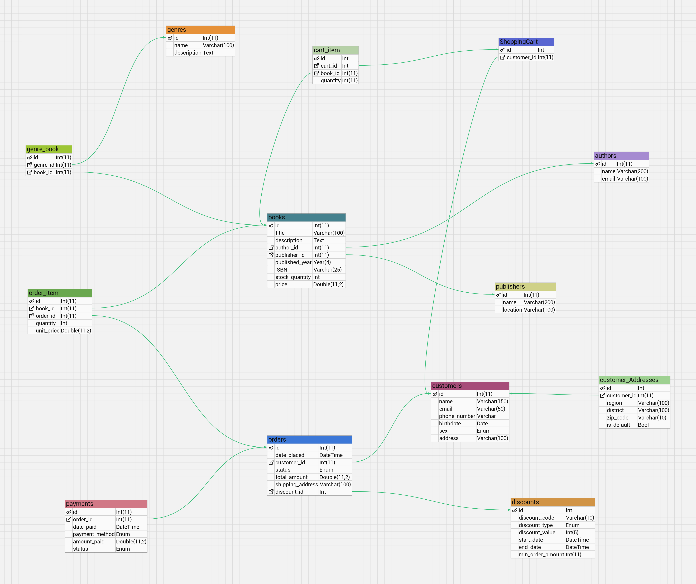

# Online Bookstore Database
An online bookstore that sells books to customers. The bookstore has multiple book categories and number of customers who can place orders.

## Entity Relationship Model
In order to model the online bookstore system using ER Model, first I identify the entities, attributes, and relationships that are involved.

### Entities and Attributes

1. **Author**: Represents an individual author.
    *Attributes*: id(PK), name, and email.

2. **Publisher**: Represents an individual publisher.
    *Attributes*: id(PK), name, and location.

3. **Book**: Represents an individual book record in the bookstore. Contains attributes.
    *Attributes*: id(PK), title, description, author_id(FK), publisher_id(FK), published_year, ISBN, stock_quantity, and price.

4. **Genre**: Represents an individual genre of books in the bookstore.
    *Attributes*: id(PK), name, and description.

5. **Book Genre**: Represents the many-to-many relationship between books and genres.
    *Attributes*: id(PK), book_id(FK), and genre_id(FK).

6. **Customer**: Represents an individual customer record who has registered with the bookstore.
    *Attributes*: id(PK), name, date of birth, sex, phone number, address, and email.

7. **Order**: Represents an individual order record placed by a customer.
    *Attributes*: id(PK), date_place, total_amount, shipping_address and customer_id(FK).

8. **Order Item**: Represents the many-to-many relationship between orders and books.
    *Attributes*: id(PK), book_id(FK), and order_id(FK), unit_price, and quantity.

9. **Payment**: Represents payment for a specific order.
    *Attributes*: id(PK), order_id, payment_method, status, date_paid, and amount_paid.

10. **ShoppingCart**: Allow customers to temporarily add books to a shopping cart before finalizing their purchase.
    *Attributes*: cart_id(PK), and customer_id(FK) 

11. **CartItems**: Represents individual item in a shopping cart.
    *Attributes*: id(PK), cart_id(FK), book_id(FK), and quantity 

12. **CustomerAddresses**: Allow customers to save multiple addresses for shipping convenience.
    *Attributes*: id(PK), customer_id(FK), region, district, zip_code, and is_default

13. **Discounts**: Allow the implementation of promotional campaigns (e.g., discount codes) to boost sales.
    **Attributes**: id(PK), discount_code, discount_type, discount_value, start_date, end_date, and min_order_amount.

### Relationships
These relationships define a well-structured SQL database schema for efficiently managing online bookstore

1. **One-to-Many**:
   - One author can write multiple books.
   - One publisher can publish multiple books.
   - One customer can place multiple orders.
   - One order can have multiple order items
   - One book can appear in multiple order items

2. **Many-to-Many**:
   - A book can belong to multiple genres, and a genre can have multiple books. This relationship is established through the join table genre_books.

3. **One-to-One**:
   - Each order can have one payment.

### Entity Relationship Diagram (ERD)

   

## The SQL Database Schema

```sql
-- Author Table
CREATE TABLE authors (
    id INT NOT NULL PRIMARY KEY AUTO_INCREMENT,
    name VARCHAR(200) NOT NULL,
    email VARCHAR(100) NOT NULL UNIQUE
);

-- Publisher Table
CREATE TABLE publishers (
    id INT NOT NULL PRIMARY KEY AUTO_INCREMENT,
    name VARCHAR(200) NOT NULL UNIQUE,
    location VARCHAR(100) NOT NULL
);

-- Books Table
CREATE TABLE books (
    id INT NOT NULL PRIMARY KEY AUTO_INCREMENT,
    title VARCHAR(100) NOT NULL UNIQUE,
    description TEXT DEFAULT NULL,
    author_id INT NOT NULL,
    publisher_id INT NOT NULL,
    published_year YEAR(4) NOT NULL,
    ISBN VARCHAR(100) NOT NULL UNIQUE,
    stock_quantity INT NOT NULL DEFAULT 0,
    price DOUBLE(11, 2) NOT NULL CHECK(price > 0),
    FOREIGN KEY (author_id) REFERENCES authors(id) ON DELETE CASCADE,
    FOREIGN KEY (publisher_id) REFERENCES publishers(id) ON DELETE CASCADE
);

-- Genres Table
CREATE TABLE genres (
    id INT NOT NULL PRIMARY KEY AUTO_INCREMENT,
    name VARCHAR(100) NOT NULL UNIQUE,
    description TEXT DEFAULT NULL
);

-- Book Genre Tables
CREATE TABLE genre_book (
    id INT NOT NULL PRIMARY KEY AUTO_INCREMENT,
    book_id INT NOT NULL,
    genre_id INT NOT NULL,
    FOREIGN KEY (book_id) REFERENCES books(id) ON DELETE CASCADE,
    FOREIGN KEY (genre_id) REFERENCES genres(id) ON DELETE CASCADE
);

-- Customers Table
CREATE TABLE customers (
    id INT NOT NULL PRIMARY KEY AUTO_INCREMENT,
    name VARCHAR(200) NOT NULL,
    email VARCHAR(100) NOT NULL UNIQUE,
    phone_number VARCHAR(20) NOT NULL UNIQUE,
    birth_date DATE DEFAULT NULL,
    sex ENUM("female", "male"),
    address VARCHAR(100) DEFAULT NULL
);

-- Orders Table
CREATE TABLE orders (
    id INT NOT NULL PRIMARY KEY AUTO_INCREMENT,
    customer_id INT NOT NULL,
    status ENUM("pending", "shipped", "delivered", "cancelled", "paid"),
    date_place DATETIME NOT NULL DEFAULT CURRENT_TIMESTAMP,
    total_amount DOUBLE(11, 2) NOT NULL,
    shipping_address VARCHAR(100) NOT NULL,
    FOREIGN KEY (customer_id) REFERENCES customers(id) ON DELETE CASCADE
);

-- Order Items Table
CREATE TABLE order_item (
    id INT NOT NULL PRIMARY KEY AUTO_INCREMENT,
    book_id INT NOT NULL,
    order_id INT NOT NULL,
    quantity INT NOT NULL CHECK(quantity > 0),
    unit_price DOUBLE(11, 2) NOT NULL,
    FOREIGN KEY (book_id) REFERENCES books(id) ON DELETE CASCADE,
    FOREIGN KEY (order_id) REFERENCES orders(id) ON DELETE CASCADE
);

-- Payments Table
CREATE TABLE payments (
    id INT NOT NULL PRIMARY KEY AUTO_INCREMENT,
    order_id INT NOT NULL,
    date_paid DATETIME DEFAULT CURRENT_TIMESTAMP,
    payment_method ENUM("mobile transfer","cash", "paypal") DEFAULT "cash",
    amount_paid DOUBLE(11, 2) NOT NULL,
    status ENUM("pending", "successful", "failed", "cancelled", "refunded"),
    FOREIGN KEY (order_id) REFERENCES orders(id) ON DELETE CASCADE
);

-- Shopping Cart
CREATE TABLE shopping_cart (
    id INT PRIMARY KEY AUTO_INCREMENT NOT NULL,
    customer_id INT NOT NULL,
    FOREIGN KEY (customer_id) REFERENCES customers(id)
);

-- Cart Item
CREATE TABLE cart_item (
    id INT PRIMARY KEY AUTO_INCREMENT NOT NULL,
    cart_id INT NOT NULL,
    book_id INT NOT NULL,
    quantity INT NOT NULL,
    FOREIGN KEY (cart_id) REFERENCES ShoppingCart(id),
    FOREIGN KEY (book_id) REFERENCES books(id)
);

-- Customer Addresses
CREATE TABLE customer_Addresses (
    id INT PRIMARY KEY AUTO_INCREMENT NOT NULL,
    customer_id INT NOT NULL,
    region VARCHAR(100) NOT NULL,
    district VARCHAR(100) NOT NULL,
    zip_code VARCHAR(10) NOT NULL,
    is_default BOOL NOT NULL DEFAULT "false",
    FOREIGN KEY (customer_id) REFERENCES customers(id)
);

-- Discounts
CREATE TABLE discounts (
    id INT PRIMARY KEY AUTO_INCREMENT NOT NULL,
    discount_code VARCHAR(10) NOT NULL UNIQUE,
    discount_type ENUM ("percentage","fixed amount") NOT NULL DEFAULT "percentage",
    discount_value INT NOT NULL,
    start_date DATETIME NOT NULL,
    end_date DATETIME NOT NULL,
    min_order_amount INT NOT NULL DEFAULT 50000
);
```
